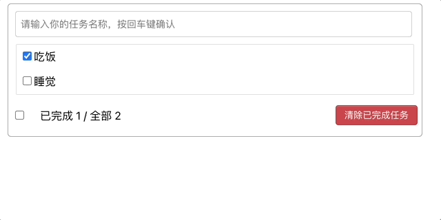

# Develop frontend todolist component through react :smile:

## React usage
1. 拆分组件、实现静态组件，注意:className, style的写法
2. 动态初始化列表，如果确定将数据放在那个组件的state中？
       -2.1. 某个组件使用：放在其自身的state中
       -2.2. 某些组件使用：放在他们共同的父组件state中(官方称此操作为：状态提升)
3. 关于父子之间通信：
       -3.1. 父组件给子组件传递数据：通过props传递
       -3.2. 子组件给父组件传递数据：通过props传递，要求父组件提前给子组件一个函数
4. 注意defaultChecked 和 chekced的区别，类似的还有：defaultValue和value
5. 状态在哪里，操作状态的方法就在哪里
